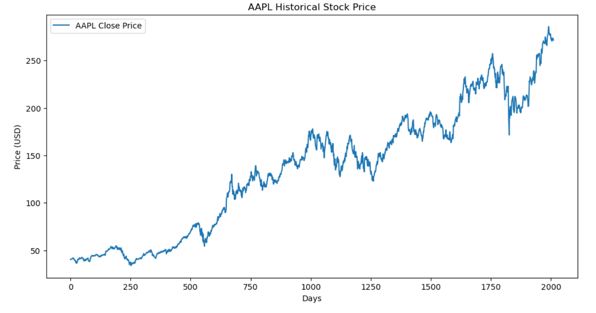
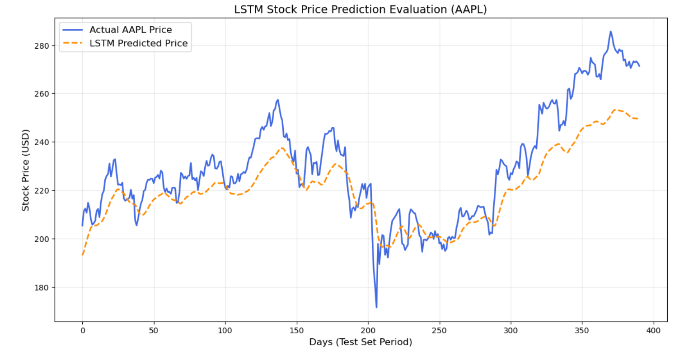

# Stock Price Forecasting with LSTM (PyTorch)

A deep learning project designed to predict future stock prices using Long Short-Term Memory (LSTM) networks built with PyTorch. This project demonstrates historical time-series data engineering, hyperparameter tuning, and model evaluation.

## Final Performance Metrics
Through strategic hyperparameter tuning (increasing the hidden layer size and optimizing the learning rate), the model's accuracy was significantly improved:

| Model Version | Hidden Size | Epochs | Learning Rate | Root Mean Squared Error (RMSE) | Directional Accuracy |
| :--- | :--- | :--- | :--- | :--- | :--- |
| Baseline Model | 50 | 10 | 0.001 | \$13.12 | 50.77% |
| **Optimized Model** | **128** | **30** | **0.0005** | **\$11.57**  | **51.54%**  |

### Visual Progress: Baseline vs. Optimized Model

#### 1. Baseline Model Results (RMSE: \$13.12)
This was our initial run using 10 epochs and a hidden size of 50. Notice the slight gap during sharp price movements:

#### 2. Optimized Model Results (RMSE: \$11.57)
After tuning the network's capacity to a hidden size of 128 and training for 30 epochs, the tracking became much tighter around major peaks:

---

### Key Takeaway
The optimized model successfully dropped the tracking error (**RMSE**) by **\$1.55 on average** across the entire unseen test set, tracking macro market trends and cyclic corrections exceptionally well.

---

## Project Overview & Architecture
Unlike standard neural networks that treat each input independently, this model utilizes an LSTM architecture to remember sequential patterns across time, which is ideal for time-series stock data where today's price is heavily dependent on past trends.

* **Data Source:** Free `yfinance` API (Yahoo Finance) pulling historical `AAPL` data.
* **Framework:** PyTorch (Deep Learning)
* **Features:** 60-Day Sliding Window Approach (using the past 60 trading days to predict the 61st).
* **Validation:** Strict 80% / 20% chronological train/test split to prevent data leakage.

---

## Core Tech Stack Dependencies
Make sure you have these core libraries installed in your Anaconda environment:
* `torch` (PyTorch)
* `yfinance`
* `pandas`
* `numpy`
* `matplotlib`
* `scikit-learn`

---

## How to Run the Project
1. Activate your Anaconda environment and launch Jupyter Notebook.
2. Open `LSTM-Stock-Forecasting.ipynb`.
3. Run the cells sequentially to fetch data, train the network, and output performance metrics.
4. Trained model weights are automatically saved locally to `lstm_stock_model.pth` for instant deployment.